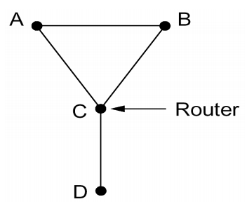

# Basic Concept

## 组成

- **工作方式上看**

    + **边缘部分**

    + **核心部分**

- **功能组成上看**

    + **通信子网**

        + **通信线路**

        + **网络互联设备（路由器、交换机、HUB等）**

    + **资源子网（或用户子网）**

        + **服务器**

        + **客户计算机**

## 功能

- **数据通信**

- **资源共享**

- **分布式处理**

- **提高可靠性**

- **负载均衡**

## 分类

### 按分布范围

- **广域网（WAN）**

- **城域网（MAN）**

- **局域网（LAN）**

- **个人区域网（PAN）**

### 按传输技术

- **广播式**

- **点对点**

### 按拓扑结构

- **总线形**

- **星形**

- **环形**

- **网状形**

### 按使用者

- **公用网**

- **专用网**

### 按交换技术

- **电路交换**

- **报文交换**

- **分组交换**

## 性能指标

- **带宽**

- **时延**

    + **发送时延（传输时延）**

    + **传播时延**

    + **处理时延**

    + **排队时延**

- **时延带宽积**

    + **传播时延 x 信道带宽**

- **往返时延**

- **吞吐量**

    + **单位时间内通过信道/接口的数据量**

- **速率**

- **信道利用率**

    + **（有数据通过时间） / （总时间）**

## 协议

- **语法**

- **语义**

- **定时关系**

# OSI

> 低三层称为**通信子网**，高三层称为**资源子网**

- **物理层**

- **数据链路层**

    + **功能：成帧、差错控制、流量控制、传输管理**

- **网络层**

    + **功能：差错控制、流量控制、拥塞控制**

- **传输层**

    + **功能：差错控制、流量控制、传输管理**

- **会话层**

    + **功能：会话管理、数据同步**

- **表示层**

    + **功能：数据表示转换、数据压缩、加密解密**

- **应用层**

# TCP/IP

- **网络接口层**

    + **相当于OSI的数据链路层和物理层**

- **网际层**

    + **相当于OSI的网络层**

- **传输层**

    + **相当于OSI的传输层**

- **应用层**

    + **相当于OSI的会话层、表示层和应用层**

> **OSI参考模型在网络层支持无连接和面向连接的通信，但在传输层仅有面向连接的通信。而TCP/IP在网际层仅有一种无连接的通信方式，但传输层支持无连接和面向连接两种模式**

# Novell NetWare

- **网络层协议：IPX，不可靠无连接**

- **传输层协议：NCP、SPX，面向连接**

# X.25分组交换网

> **面向连接，支持交换虚电路和永久虚电路**

# B-ISDN和ATM

- **B-ISDN的技术基础是异步传输模式ATM（Asynchronous Transfer Mode）**

    + **ATM**

        + **异步传输，没有主时钟**

        + **传输单元是短的、定长的包，称为信元（cell）**

        + **面向连接**

- **SDU：服务数据单元**

- **PCI：协议控制信息**

- **PDU：协议数据单元**

    + **PDU = SDU + PCI**

- **服务原语**

    + **请求（Request）**

    + **指示（Indication）**

    + **响应（Response）**

    + **确认（Confirm）**

# 物理层

- **模拟信号：连续**

- **数字信号：离散**

- **数据传输方式：串行传输、并行传输（远距离串行传输）**

- **码元：一个码元包含若干比特**

- **基带传输：基带信号将数字信号1和0直接用两种不同的电压表示，然后送到数字信道上传输**

- **宽带传输：宽带信号将基带信号进行调制后形成频分复用模拟信号，然后送到模拟信道上传输**

- **码元传输速率：单位波特**

- **信息传输速率：单位比特**

- **！！！物理层讨论的各种速率一般都是指发送速率，即从节点发出数据需要的时间（数据在信道上的传播时延一般忽略不计）！！！**

- **TRICKS：从发出第一个数据包到发完最后一个数据包的这段时间整体考虑，计算出发完所有数据的总时间，然后再考虑最后一个数据包的传输时间即可**

## 奈奎斯特定理

- **理想低通（没有噪声，带宽有限）信道下的极限数据传输率 = 2Wlog2(V)**

    + **W为理想低通信道带宽，单位Hz**

    + **V为码元离散电平数目（即多少种“状态”）**

## 香农定理

- **信道的极限数据传输率 = Wlog2(1 + S/N)**

    + **W为理想低通信道带宽，单位Hz**

    + **S为信号所传输信号的平均功率，N为信道内部的高斯噪声功率**

    + **信噪比一般以db为单位表示，数值上等于10log10(S/N)**

> **信道极限数据传输率取决于上述两个定理计算出的最小值（若题目没给定理适用的充分条件，则计算一个即可）**

> **TRICKS：若题目没给奈/香定理的适用条件，则直接按照W·比特位数计算最大速率**

## 编码与调制

> **编码：数据 => 数字信号，调制：数据 => 模拟信号**

### **数字数据编码为数字信号**

- **归零编码（RZ）**

    + **高电平为1，低电平为0**

    + **每个时钟周期中间跳变到低电平（归零），带有时钟信息，支持同步**

- **非归零编码（NRZ）**

    + **高电平为1，低电平为0**

    + **无需归零，不带时钟信息，不支持同步**

- **反向非归零编码（NRZI）**

    + **信号保持不变代表1，信号翻转代表0**

    + **信号翻转作为时钟信息，支持同步**

- **曼彻斯特编码**

    + **将一个码元分成两个相等的间隔，前高后低表示码元1，前低后高表示码元0**

    + **带有时钟信息，支持同步**

    + **所占频带宽度是原始基带宽度的两倍**

    + **2个码元对应1个比特**

    + **以太网使用的编码方式为曼彻斯特编码**

- **差分曼彻斯特编码**

    + **若码元为1，则前半个码元的电平与上一码元的后半个码元的电平相同；若码元为0，则不同**

    + **带有时钟信息，支持同步**

    + **2个码元对应1个比特**

    + **局域网使用的编码方式为差分曼彻斯特编码**

- **4B/5B编码**

### **数字数据调制为模拟信号**

- **幅移键控（ASK）**

    + **改变载波信号振幅来表示1和0，载波频率相位不变**

    + **易实现，抗干扰能力差**

- **频移键控（FSK）**

    + **改变载波信号的频率表示1和0，载波振幅和相位不变**

    + **易实现，抗干扰能力强**

- **相移键控（PSK）**

    + **改变载波信号相位来表示1和0，载波振幅频率不变**

- **正交振幅调制（QAM）**

    + **ASK与PSK的结合**

### **模拟数据编码为数字信号**

- **脉冲编码调制（PCM）**

    + **采样频率必须大于等于原始信号最大频率的两倍**

    + **适用于音频**

### **模拟数据调制为模拟信号**

- **频分复用（FDM）**

## 交换技术

### **电路交换**

> **采用时分复用**

- **三阶段：连接建立、数据传输、连接释放**

- **通信时延小**

- **使用场景：电话网**

### **报文交换**

- **报文带有源地址与目标地址，在交换节点采取“存储-转发”方式**

- **无须建立连接**

- **全部数据不分组一起传输**

### **分组交换**

> **采用统计复用**

- **数据分组传输，每个分组加上必要控制信息（“存储-转发”方式）**

- **比报文交换传输时延小，但有效数据利用率由于头部额外信息的附加比报文交换低**

- **数据报**

    + **无须建立连接**

    + **尽最大努力交付**

    + **数据包无序到达**

    + **传输路径不定，随机选择节点进行转发，节点出错影响小，容错率高**

- **虚电路**

    + **需要建立逻辑上的连接，并分配虚电路号**

    + **面向连接，提供可靠服务**

    + **数据包有序到达**

    + **传输路径一定，当某个路径上的某节点损坏时，整条虚电路不可用**

    + **分组首部不再包含地址，而是包含虚电路标识符，每个节点依据标识符进行转发数据包**

    + **每个节点可以通过多条虚电路**

    + **虚电路不只是临时性的，还可细分为永久型虚电路（PVC）和交换型虚电路（SVC）**

    + **使用场景：ATM**

## 交换结构（Switch Fabric）

- **crossbar交换**

- **空分交换**

- **时分交换**

## 传输介质

- **双绞线**

    + **即可用于模拟传输，也可用于数据传输**

- **同轴电缆**

    + **基带同轴电缆**

        + **50欧姆，用于数据传输**

    + **宽带同轴电缆**

        + **75欧姆，用于模拟传输**

- **光纤**

    + **多模光纤**

    + **单模光纤**

## 接口特性

- **机械特性**

    > **规定物理接口的规格、引脚数量和排列情况**

    + **例子：25芯连接器，DTE为插头，DCE为插座**

- **电气特性**

    > **规定传输时，线路上信号的电压高低、阻抗匹配、传输速率和距离限制**

    + **例子：采用非平衡型电气特性，低于-3V为“1”，高于+4V为“0”，最大20Kbps，最长15m**

- **功能特性**

    > **定义各条物理线路的功能**

    + **线路的功能分为四大类**

        + **数据**

        + **控制**

        + **定时**

        + **地**

    + **例子：**

- **规程特性**

    > **定义各条物理线路的工作规程和时序关系**

    + **例子：**

## 设备

- **中继器**

    + **对信号再生（而非简单地将衰减地信号放大）**

    + **5-4-3规则**

    + **所连网段数据传输率和协议需相同**

- **集线器**

    + **多端口的中继器**

    + **共享带宽**

    + **不具备存储-转发，收到信号后从其余端口全部转发（半双工）**

    + **同属一个冲突域和一个广播域**

# 数据链路层

## 功能

- **为网络层提供服务**

    + **无确认的无连接服务**

    + **有确认的无连接服务**

    + **有确认的面向连接服务**

    + **注：有连接就一定要有确认，不存在无确认的面向连接的服务**

- **链路管理**

- **帧定界、帧同步、透明传输**

- **流量控制：控制发送方的发送速率**

- **差错控制**

## 组帧

> **组帧时既要加首部也要加尾部**

- **字符计数法**

    + **在帧头部使用一个计数字段标明帧内字符数（包括计数字段本身）**

- **字符填充首尾定界符法**

    + **在帧首尾加上特定的“开始”（DLE STX）与“结束”（DLE ETX）字符来界定帧**

    + **若在数据中也出现定界符，则在其前填充转义字符（DLE）**

    + **“DLE”是一个字符，而不是三个字符组成的串**

- **零比特填充的首尾标志法**

    + **使用“01111110”来标志一帧的开始与结束**

    + **在数据信息位中，为了实现透明传输，发送方在发送数据时，连续遇到5个“1”时，在其后插入一个0；接受方作相反操作，即连续遇到5个“1”，则删除其后紧邻的“0”**

- **违规编码法**

    + **利用曼彻斯特编码中不会出现的的“高-高”与“低-低”电平**

- **注意：前两种方法是面向字符的，第三种方法是面向比特的**

## 差错控制

### **检错编码**

- **奇偶校验码**

    + **在数据头或尾附加一个校验元“0”或1，使加上校验元后的数据中的“1”个数为奇数个或偶数个，分别对应于奇校验与偶校验。接收方在收到数据后，检验数据的奇偶性，若奇偶性与采用的校验方式相同，则认为无差错**

    + **例如1101，采用奇校验，则加上校验位后为01101，若接收方收到数据后发现“1”的位数仍为奇数，则认为传输无差错；若为偶数，则认为传输过程中有奇数个比特位发送差错**

    + **无论是对于奇校验还是偶校验，若传输过程中恰有偶数个比特位都发生差错，那么数据的“奇偶性”仍然不变，接受方认为无差错，所以奇偶校验只能检查出奇数个比特位的错误**

- **循环冗余校验码（CRC）**

    > 设待传输数据为M=101001，G(x)=1101

    + **发送方和接收方事先商定G(x)（最高位和最低位必须为1），使带校验码的帧恰能被其整除。接收方用相同的G(x)去除收到的帧，若无余数，则认为无差错**

    + **计算步骤如下：**

        + **若G(x)的阶（即G(x)所对应多项式的最高次数，由于最高位必为1，故阶为G(x)的总位数减1）为r，则在M的低位端（右端、末端）加上r个0，即101001000**

        + **用加0后的数据除以G(x)，除法规则是异或，两位相异为1，相同为0**

        + **用除得的余数R（=001），去代替数据末尾的r个0，即101001001**

        + **上述所得余数也叫帧检验序列（FCS）**

### **纠错编码**

- **海明码（汉明码）**

    + **“纠错”d位，需要海明距2d+1；“检错”d位，需要海明距d+1**

    + **n+k <= 2^k-1（n为有效信息位数，k为校验位数）**

    + **编码步骤：计网p72，计组p29**

## 基本的数据链路层协议

### **无约束单工协议**

### **单工停等协议**

### **有噪声信道的单工协议**

## 流量控制、可靠传输、滑动窗口机制

- **停止-等待流量控制**

- **滑动窗口流量控制**

- **可靠传输机制**

    + **自动重传请求（ARQ）**

        + **停止-等待ARQ**

        + **后退N帧ARQ**

        + **选择性重传ARQ**
    
    + **后两者称为连续ARQ协议**

### **单帧滑动窗口与停止-等待协议**

> **滑动窗口协议——一比特滑动窗口协议**

- **发送方没发送一帧都要等待接收方的确认信号，之后才能发送下一帧**

- **发送窗口=1，接收窗口=1**

- **为了判定重复帧与超时重传，发送方与接收方设置帧缓冲区**

### **多帧滑动窗口与后退N帧协议（GBN）**

> **滑动窗口协议——退后n帧重传协议**

- **发送方可连续发送多帧，接收方每次只能接收1帧，并适时发送累计确认**

- **累计确认：确认帧序号之前的帧全都已成功接收**

- **若接收方接收某一帧出错，则其后到达的各帧均舍弃**

- **接收窗口=1。若采用n比特对帧序列编号，则发送窗口的尺寸WT需满足1 <= WT <= 2^n - 1**

### **多帧滑动窗口与选择重传协议（SR）**

> **滑动窗口协议——选择重传协议**

- **发送方可连续发送多帧，接收方也可连续接收多帧，采取单帧确认，无累计确认**

- **接收方可随时发送否定帧NAK要求发送方重传某帧**

- **只需重传出错的帧**

- **若采用n比特对帧序列编号，发送窗口WT+接收窗口WR <= 2^n，WR <= 2^(n-1)**

- **不能保证帧序列按序到达**

- **TRICKS**

    + **接收窗口=1可保证帧序列按序到达**

    + **引发超时重传机制的两种方式：**

        + **发送方发送帧丢失，接收方没收到数据自然也就不会应答，在发送方相应帧的计时器超时后，发送方重新发送该帧**

        + **接收方成功接收发送方发送的帧，但应答帧丢失，发送方的计时器超时后，重新发送对应帧，接收方收到重复的帧并舍弃该帧，重新发送应答帧**

    + **信道效率（信道利用率）：在一个发送周期（发送方从开始发送数据到收到第一个确认帧为止）内，有效发送数据的时间占整个周期时间的比率**

    + **计算信道效率类似的题，模拟单周期内发送过程（双横轴分别代表发送方和接收方时间，发送数据沿轴向移动，数据传播沿两轴间斜轴向移动）**

## 协议说明与验证

### **协议形式化描述技术**

### **有限状态机模型**

### **Petri网模型**

## 介质访问控制

### **信道划分介质访问控制**

- **频分多路复用（FDM）**

- **时分多路复用(TDM)**

    + **时间片轮转，共享带宽**

    + **统计（异步）时分多路复用（STDM）**

        + **按需分配时隙，独享带宽**

- **波分多路复用（WDM）**

- **码分多路复用（CDM）**

    + **码分多址（CDMA）**

        + **各站点码片序列正交**

        + **数据发送时线性叠加各站点码片序列（向量），接收数据时计算该站点码片与接收数据的规格化内积即可（-1代表0，1代表1）**

### **随机访问介质访问控制**

- **ALOHA协议**

    + **纯ALOHA协议**

    + **时隙ALOHA协议**

- **CSMA协议**

    + **1-坚持CSMA**

        + **空闲：立即发送数据**

        + **忙：继续坚持侦听**

    + **非坚持CSMA**

        + **空闲：立即发送数据**

        + **忙：放弃侦听，等待一个随机时间后再侦听**

    + **p-坚持CSMA**

        + **空闲：以概率p发送数据，以概率1-p推迟到下一个时隙**

        + **忙：持续侦听，直至信道空闲**

- **CSMA/CD协议**

    + **“先听后发，边听边发，冲突停发，随机重发”**

    + **冲突碰撞后停止发送，回传STOP信号告知站点发送失败**

    + **τ为单程传播时延，2τ为争用期**

    + **最小帧长 = 总线传播时延（单程，即τ） x 数据传输率 x 2，即最小帧长为节点在争用期内发出的比特数**

    + **CSMA/CD采用二进制指数退避算法来解决碰撞问题：**

        + **确定基本退避时间，一般取争用期，即2τ**

        + **设k为重传次数，则k=min{重传次数，10}**

        + **从离散整数集合[0, 1, ..., 2^k - 1]中随机取数r，重传所需的退避时间即为r·2τ**

        + **当重传次数达16次仍不成功时，舍弃该帧，并向高层报告错误**

- **CSMA/CA协议**

    + **适用于无线局域网**

    + **不需要在发送过程中进行冲突检测（预约信道）**

    + **除了指数退避之外，还有下列特性：**

        + **预约信道：RTS/CTS帧。通知其他站点本站需要占用信道的时间，令其他站点在本站发数据期间内不发数据**

        + **ACK帧：对正确收到的帧进行回传ACK帧确认**

- **令牌传递协议**

    + **令牌只有一个，令牌随机分配到某站点，只有持有令牌的站点才能发送数据，故不会产生冲突**

    + **适用于负载高的信道**

## 局域网（LAN）

- **类型**

    + **以太网（目前使用范围最广）：逻辑拓扑总线型，物理拓扑星型或拓展星型**

    + **令牌环（IEEE 802.5）：逻辑拓扑环形，物理拓扑星型**

    + **FDDI（IEEE 802.8）：逻辑拓扑环形，物理拓扑双环**

- **IEEE 802定义的局域网参考模型只对应于OSI参考模型的数据链路层和物理层，并将数据链路层拆分成两个子层：逻辑链路控制（LLC）子层和媒体接入控制（MAC）子层**

### **以太网与IEEE 802.3**

- **两项措施简化通信：**

    + **无连接**

    + **不对帧编号**

    + **不要求确认**

    + **尽最大努力交付，提供不可靠服务，差错纠正交给高层**

- **以太网类型**

    > BASE前数据代表数据率，单位为Mb/s；“BASE”代表基带信号（基带传输，曼彻斯特编码）；其后的数字代表电缆长度，T表示双绞线，F表示光纤

    + **10BASE5**

    + **10BASE2**

    + **10BASE-T**

    + **10BASE-FL**

    + **高速（快速）以太网**

        + **100BASE-T：支持半双工、全双工。半双工工作在CSMA/CD协议下，全双工不使用CSMA/CD协议**

        + **吉比特以太网：支持半双工、全双工。半双工工作在CSMA/CD协议下，全双工不使用CSMA/CD协议**

        + **10吉比特以太网：只支持全双工，不使用CSMA/CD协议。使用光纤代替铜线**

- **以太网（IEEE 802.3）MAC帧格式**

    + **IP数据报首部添加：添加目的地址、源地址、类型**

    + **IP数据报尾部添加：FCS帧检验序列**

    + **数据部分长度为46~1500字节**

### **无线局域网与IEEE 802.11**

- **采用CSMA/CA**

- **IEEE 802.3与IEEE 802.11的MAC帧格式不同**

- **AP（Access Point）等，看看就好**

### **令牌环网**

- **访问权公平**

- **书p111**

## 广域网（WAN）

- **广域网由一些结点交换机（不是路由器）及连接这些交换机的链路组成**

- **传输方式为存储-转发**

- **对应于OSI参考模型的网络层、数据链路层、物理层**

### **广域网数据链路层控制协议**

- **PPP协议**

    > **面向字节（字符填充）**

    + **三个组成部分：**

        + **链路控制协议（LCP）**

        + **网络控制协议（NCP）**

        + **一种成帧方式**

    + **PPP帧格式：书p118**

    + **PPP是点对点的协议，并不是总线型，故无须CSMA/CD，最小帧长也就为0**

    + **提供差错检测（CRC），不提供纠错，不可靠传输，不使用序号和确认机制**

    + **仅支持点对点的链路通信，不支持多点线路**

    + **只支持全双工链路**

    + **PPP协议两端可以运行不同的网络层协议，但仍可以使用同一个PPP通信**

- **HDLC协议**

    > **面向比特（使用零比特填充的首尾标志法）**

    + **站：主站、从站、复合站**

    + **基本操作模式**

        + **正规响应模式（NRM）**

        + **异步响应模式（ARM）**

        + **异步平衡模式（ABM）**

    + **HDLC帧：书p120**

        + **帧结构**

            + **定界符：01111110**

            + **地址域**

            + **控制域**

                + **序号：滑动窗口（3位序号，发送窗口大小为7）**

                + **确认：捎带第一个未收到的帧序号**

                + **探询/结束P/F位**

                + **类型**

            + **数据域**

            + **校验和：CRC校验**

        + **帧类型**

            + **信息帧**

            + **监控帧**

            + **无序号帧**

    + **使用编号和确认机制，提供可靠传输**

- **X.25的链路层协议LAPB**

    > **面向比特**

    + **是HDLC的子集**

## 设备

- **网桥**

    + **分类：**

        + **透明网桥**

        + **源路由网桥**

    + **网桥对接收到的帧不作任何修改**

    + **隔离冲突域，不隔离广播域**

    + **连接k个不同LAN的网桥具有k个MAC子层和k个物理层**

- **交换机**

    + **等效于多端口网桥**

    + **全双工**

    + **各端口独享带宽（交换机总带宽等于某一段时间内通过整个交换机的最大数据量）**

    + **隔离冲突域，不隔离广播域（如构建VLAN可进一步隔离广播域）**

- **区别**

    + **网桥只有一个端口，故在其连接的网段内的计算机只能以类总线型拓扑连接，故网段内两个计算机的通信不经过网桥的转发；而交换机具有多个端口，计算机一般直接连在端口上，故网段内两个计算机通信是要通过交换机的转发的**

- **TRICKS：912大题必考填转发表/路由表**

    + **转发表总是记录 源MAC地址+交换机接收数据的端口号（非转发端口号）**

    + **网桥/交换机都不对接收数据的源端口进行重复转发，只转发剩余端口**

    + **若网桥/交换机对接收到的帧的MAC地址查找转发表获取的端口号与接收端口一致，则舍弃该帧**

    + **网桥/交换机不会对帧MAC地址（源、目的）进行修改（二层设备转发不改变帧的MAC地址、IP地址，但三层设备会改变MAC地址）**

    + **网桥/交换机转发表自学习流程梳理：**

        + **网桥/交换机接收到数据帧，检查该帧的源MAC地址是否已在转发表中。若不在，则记录源MAC地址和接收该帧的端口号；若已存在，则进行下一步**

        + **在转发表中查找目的MAC地址**

            + **若查找成功，则检查端口号与接收端口号是否一致。若一致，则舍弃该帧；若不一致，则向端口号转发该帧**

            + **若查找失败，则直接从其余端口转发该帧**

# 网络层

> **尽最大努力交付，不可靠服务**

## 主要功能

- **异构网络互联**

    + **异构指数据链路层与物理层不同**

- **路由与转发**

- **拥塞控制**

    + **拥塞发生标志：通信子网负载增加，网络吞吐量降低**

    + **方法：**

        + **开环控制：静态控制**

        + **闭环控制：动态控制**

## 路由算法

- **静态路由**

    + **路由表静态（人工）维护**

- **动态路由**

    + **距离-向量路由算法（RIP）**

        + **定期将整个路由转发表发送给所有相邻节点（将自身的路由转发表全部发给相邻的路由节点）（全局=>局部）**

        + **“好消息传得快，坏消息传得慢”，故有的路由节点会收到无效的路由表信息，造成路由环路**

    + **链路状态路由算法（OSPF）**

        + **定期将相邻链路的路由转发表项发送给所有节点（将自身的路由转发表中涉及相邻链路的表项发给所有其余节点）（局部=>全局）**

    + **水平分裂算法（Split Horizon）**

        > **更新时，某个路由节点向邻居节点发送自身的路由表时，不发送与邻居节点相邻节点的路由表项（但可以发送路由节点自身=>邻居节点的表项）**

        + **水平分裂（Split Horizon）算法与RIP工作过程一样，不同之处在于到X的距离并不向真正通向X的邻居节点报告（实际L，向该邻居节点报告的距离为无穷大）**

        + **如下图，C告诉D它到A的真实距离，但C不告诉B它到A的距离（因为B是A的邻居）**

        > **水平分裂算法可以看成是以“接受邻居RIP路由表消息的节点为源点的最短路径树，只有树边的距离向量才会发送给源点”**

    

- **层次路由**

    + **互联网划分若干较小自治系统，每个自治系统自行决定采用何种路由选择协议**

    + **自治系统内的路由选择协议称为内部网关协议（IGP）**

    + **自治系统间的路由选择协议称为外部网关协议（EGP）**

    + **每个路由器都知道在本区域内如何把分组路由到目的地的细节，但不用知道其他区域的内部结构**

## IPv4

### **IPv4分组格式**

> 注意IP数据报首部中，**首部长度、总长度、片偏移，基本单位分别为 4B、1B、8B**

- **版本（Version）：4位。指IP版本，IPv4或IPv6**

- **首部长度（Head Length）：4位。以4B为单位，最大值为60B（15 x 4B）。常用首部长度为20B**

- **总长度（Total Length）：16位。以B为单位，因此数据报最大长度为65535B**

- **标识（Identification）：16位。每产生一个数据报加1（主要为了标识分片属于哪个数据报）**

- **标志（Flags）：3位。MF（More Fragment）与DF（Don’t Fragment）**

- **片偏移（Offset）：13位。以8B为单位。分片在原分组中较数据部分的相对位置**

- **首部校验和（FCS）：16位。只校验分组的首部，不校验数据部分**

- **生存时间（TTL）：8位。**

- **协议（Protocol）：8位。6表示TCP，17表示UDP**

- **源地址（Source Address）：32位**

- **目的地址（Destination）：32位**

### **IP数据报分片**

- **一个链路层数据报能承载的最大数量为最大传送单元（MTU）**

- **分片在目的主机处重组**

- **收到数据报分片后：**

    + **标识号（Identification）决定该分片属于哪个数据报**

    + **标志位（Flags）的MF=1，则后续还有分片；MF=0，则该分片为最后一个分片。DF=1表示禁止分片，DF=0表示允许分片。**

    + **偏移量（Offset）决定分片在原数据报中相对于数据部分处于哪个位置**

### **IPv4地址**

- **A类（1~126）：网络号8位（第一位固定为0），主机号24位**

- **B类（128~191）：网络号16位（前两位固定为10），主机号16位**

- **C类（192~223）：网络号24位（前三位固定为110），主机号8位**

- **D类（224~239）：多播地址**

- **E类（240~255）：保留后用**

- **保留地址：**

    + **主机号全0表示网络本身，主机号全1表示本网络广播地址**

    + **127.0.0.0为环路自检地址，表示任意主机本身，目的地址为环回地址的IP数据报永远不会出现在任何网络上**

    + **0.0.0.0表示本网络上的本主机**

    + **255.255.255.255表示整个TCP/IP网络的广播地址，等效于本网络的广播地址**

- **可用网络/主机数：**

    + **A类：2^7 - 2 / 2^24 - 2**

    + **B类：2^14 - 1 / 2^16 - 2**

    + **C类：2^21 - 1 / 2^8 - 2**

### **网络地址转换（NAT）**

- **本质：几台计算机使用不同的私有（专用）地址，在需要和因特网通信时，通过路由器的NAT表将私有地址映射为公网地址，这样就达到多台计算机共用一个公网地址的目的，节省了IP的分配数**

- **注意：NAT映射不仅需要IP地址，还需要端口号（既然多台计算机共用一个公网地址，在发出数据的时候自然没问题，但在接收数据的时候，由于公网地址唯一，无法确认由哪台主机接收，故还需使用端口号映射）**

- **路由对目的地址是私有地址的数据报一律不进行转发**

- **私有IP网段：**

    + **A类：1个A类网段，即10.0.0.0~10.255.255.255**

    + **B类：16个B类网段，即172.16.0.0~172.31.255.255**

    + **C类：256个C类网段，即192.168.0.0~192.168.255.255**

> 普通路由器在收到数据报后，不会改变数据报首部的源、目的IP地址字段，而是通过ARP协议获取下一跳IP地址的MAC地址，并将本路由器端口的MAC地址一并覆盖写入数据帧的源、目的MAC中（转发下一跳的过程本质上还是在不同的局域网内传输）。但如果是支持NAT功能的路由器，则需要将源专用（私有）IP地址通过路由器的NAT映射表映射为公网IP地址后覆盖写入首部的源IP地址再进行发送。**综上，在网络层传输数据报，MAC地址不断改变，IP地址不变（除了NAT地址转换时，也就是发出的第一个路由与转发的最后一个路由，需要NAT改变IP地址）；在数据链路层传输数据帧，IP不变，MAC不变**

> **NAT路由器由于能识别端口号，故其工作在传输层**

### **子网**

- **子网掩码**

- **增加子网数量，不增加网络数量**

- **无分类域间路由选择（CIDR）**

    + **IP::={<网络前缀>, <主机号>} 或 IP地址/网络前缀比特数（CIDR记法）**

    + **CIDR可根据需求数量先决定主机号位数，进而再决定网络号位数（在分类网络中，例如某单位只需要8个地址，直接给一个A/B/C地址都太浪费了，CIDR可以直接划分主机号位数为4，可表示14个地址，这样利用率高）**

    + **路由聚合**

    + **最长前缀匹配**

### **ARP**

> **网络层协议**

- **在LAN内传输数据时，若ARP表中没有目的MAC地址，则发送带有目的IP地址的广播帧，目的计算机收到数据帧并发回自身的IP地址与MAC地址的映射关系**

- **在LAN间传输数据时，根据下一跳的IP地址在ARP表中找到对应的MAC地址，将数据报根据源、目的MAC封装成帧然后传输到下一跳路由器处。所以MAC地址是会改变的，而IP不变（除了NAT时）**

### **DHCP**

> **应用层协议**

- **给主机动态分配IP地址（有租用期）**

- **DHCP服务器与客户机通过广播方式交互，使用UDP（DHCP执行期间，双方的IP地址都未标识，自然不可能通过定向单播交互，也不可能通过TCP建立连接了）**

- **DHCP分配的IP属于私有（专用）IP地址，包括端口号**

### **ICMP**

> **网络层协议**

- **报告差错和异常情况**

- **分为ICMP差错报告和ICMP询问报文**

- **ICMP差错报告**

    + **终点不可达：不能交付数据报**

    + **原点抑制：拥塞放弃**

    + **时间超时：TTL为零**

    + **参数问题**

    + **改变路由**

- **不发送ICMP差错报告：**

    + **对ICMP差错报告不再发送**

    + **对第一个分片发送，其余不发送**

    + **组播地址不发送**

    + **特殊地址不发送（127.0.0.0、0.0.0.0）**

- **PING使用ICMP回送请求和回答报文**

## IPv6

- **128位地址**

- **首部长度固定，没有首部校验和选项**

- **IPv6不支持分片（只能在包的源节点分片）**

- **IPv6首部长度必须是8B的整数倍，而IPv4是4B的整数倍**

- **双冒号表示法只能出现一次**

## 路由协议

- **自治系统（Autonomous System，AS）**

- **域内路由和域间路由**

    + **内部网关协议（IGP）**

        + **RIP**

        + **OSPF**

    + **外部网关协议（EGP）**

        + **BGP**

### **路由信息协议（RIP）**

> **应用层协议，使用UDP传送数据（端口520）**

- **距离为“跳数”，优先选择跳数少的路径**

- **距离等于16及以上表示网络不可达，只适用于小型互联网，可能会出现环路**

- **每间隔30s广播RIP路由更新信息**

- **仅按固定时间间隔和相邻路由器交换全部信息**

- **可能出现“慢收敛”**

### **开放最短路径优先协议（OSPF）**

> **网络层协议，使用IP数据报传送**

- **只有当链路状态变化时，才使用洪泛法向AS内的所有路由器发送相邻链路信息（RIP则不管网络拓扑变化与否，定期交换信息）**

- **收敛快**

- **OSPF能将AS再划分为若干更小的范围，称为区域，洪泛法只在区域内交换信息（区域其实就相当于范围更小的AS，性质特性与AS一致）**

### **边界网关协议（BGP）**

> **应用层协议，基于TCP**

- **BGP力求寻找一条能够到达目的网络且比较好的路由，而并非寻找最佳路由**

- **采用路径向量路由选择协议（注意RIP是距离向量）**

- **与相邻节点交换信息，首次交换整个路由表，后续只交换有变化的部分**

## IP组播（多播）

> **UDP**

- **概念：在直播或会议等场景中，媒体服务器需要向大量主机发送数据报，如果采用单播，在给服务器造成压力的同时还会给网络造成压力。使用组播时，媒体服务器只需发送一次数据报，只有在数据传送路径出现分岔时才将分组复制并继续转发**

- **IP组播地址**

    + **D类地址（224~239）**

    + **D类IP地址与以太网MAC地址映射关系（W-I）**

        + **IP组播地址后23位映射到MAC地址**

- **因特网组管理协议（IGMP）**

## 移动IP

- **概念：主机从LAN移动到另一个LAN时，如何通信**

- **主机原来所在的LAN称为归属代理（本地代理），外部LAN称为外部代理，移动节点拥有永久的IP地址。当移动节点移动至其他LAN时，本地地址是不变的，移动节点会向归属代理请求注册一个新地址，称为转交地址，以后的通信都以归属节点为中介，间接通信**

- **移动主机有两个IP地址，即主地址和辅地址（转交地址），主地址不变，转交地址随位置改变而变**

## 设备

- **路由器**

- **TRICKS：**

    + **RIP协议**

        + **计算更新后的路由节点到其余各节点的最短路径**

            + **已知与路由节点相邻的各节点发来的完整路由表（向量），以及路由节点到相邻各节点的距离，则将各节点的路由向量分别对应加上路由节点到各节点的距离，得到若干个新向量，对若干个向量的每个对应分量取最小值，组成新向量，该向量即为更新后的路由转发表**

    + **x播**

        + **单播**

        + **多播（组播）**

        + **广播**

    + **如果一个存储转发（不含直通式）设备实现了某个层次的功能，那么它就可以在两个互联的网段上使用不同的协议**

# 传输层

> **端到端**

- **套接字：（主机IP地址，端口号）**

- **TCP：不提供广播、组播，全双工可靠逻辑信道**

- **UDP：不可靠**

- **复用：发送方不同的应用进程都可使用同一个传输层协议传送数据**

- **分用：接收方的传输层在剥去报文首部后能够把这些数据正确交付到目的应用进程**

- **端口**

    + **熟知端口号（0~1023）**

        + **FTP：控制连接21，数据连接20**

        + **TELNET：23**

        + **SMTP：25**

        + **DNS：53**

        + **TFTP：69**

        + **HTTP：80**

        + **SNMP：161**

    + **登记端口号（1024~49151）**

    + **客户端端口号（49152~65535）**

## UDP

> **面向报文，仅在IP数据报服务之上增加了：复用和分用以及差错检测**

- **优点**

    + **无需建立连接**

    + **无连接状态**

    + **分组首部开销少：仅8B**

    + **无拥塞控制：时延低**

- **尽最大努力交付，不保证可靠交付，所有维护传输可靠性的工作在应用层完成**

### **UDP首部格式**

- **源端口：16位**

- **目的端口：16位**

- **长度：16位，包括首部和数据**

- **校验和：16位，不想计算校验和则全0**

### **UDP校验**

- **临时添加12B的伪首部（包括源IP地址、目的IP地址等），校验和计算伪首部、首部和数据**

- **伪首部不向下传送也不向上提交**

- **计算方法：二进制反码运算求和再取反（若UDP数据报部分长度不是偶字节，需填充一个全0字节，此字节也不发送）**

## TCP

> **面向字节流**

### **特点**

- **面向连接**

- **每条TCP连接只能有两个端点（一对一，所以不支持多播）**

- **提供可靠交付服务，保证数据无差错、不丢失、不重复且有序**

- **提供全双工通信**

### **TCP报文段**

> **TCP传送的数据单元称为报文段**

- **源端口、目的端口：各占2B**

- **序号字段：占4B，表示发送报文段的第一个字节的编号**

- **确认号字段：占4B，表示该确认号之前（不包括）的字节流都收到了（累计确认）**

- **数据偏移（首部长度）：占4位，以4B为单位，首部长度前20B固定，最大可达60B**

- **保留字段：占6位**

- **紧急位（URG）**

- **确认位（ACK）**

- **推送位（PSH）**

- **复位位（RST）**

- **同步位（SYN）**

- **终止位（FIN）**

- **窗口字段：占2B，表示允许对方发送的数据量，以字节为单位**

- **校验和：占2B，校验和检验首部和数据（和UDP类似，也要加上12B的伪首部，只需将UDP伪首部的第4个字段，即协议字段的17改成6，其余和UDP一致）**

- **紧急指针字段：占16位**

- **选项字段**

- **填充字段**

### **TCP连接管理**

> **TCP连接的端口称为套接字**

- **TCP连接建立（三次握手）**

    + **SYN=1，seq=x**

    + **SYN=1，ACK=1，seq=y，ack=x+1**

    + **ACK=1，seq=x+1，ack=y+1**

- **TCP连接释放（四次挥手，双方均可申请）**

    + **FIN=1，seq=u**

    + **ACK=1，seq=v，ack=u+1（半关闭，连接单方向释放，另一方还可继续发送数据）**

    + **FIN=1，ACK=1，seq=w，ack=u+1**

    + **ACK=1，seq=u+1，ack=w+1（完全关闭，连接双向释放）**

### **TCP可靠传输**

- **序号**

    + **由于TCP是面向字节流的，故TCP给每个字节编号**

- **确认**

    + **TCP默认使用累计确认**

- **重传**

    + **超时**

    + **冗余ACK（冗余确认）：收到连续3个同一序号的ack确认报文，立即重传（注意一定要连续收到）**

### **TCP流量控制**

- **接收方在发往发送方的TCP报文段中的窗口字段写入自身可接收的最大数据缓存量（接收窗口，rwnd），发送方收到报文后，将自身的发送窗口设置为窗口字段值**

- **发送方的发送窗口取决于拥塞窗口（cwnd）和接收窗口（rwnd）的最小值**

- **相比于数据链路层的滑动窗口，传输层可动态改变窗口大小**

### **TCP拥塞控制**

> **最大报文段长度（MSS）：TCP报文段中的数据字段的最大长度**

- **发送窗口上限值 = min[rwnd, cwnd]**

#### **慢开始和拥塞避免**

> **慢开始 => 拥塞避免 => 拥塞处理 => 慢开始.......**

- **慢开始**

    + **cwnd初始值为MSS（一般为1），每收到一个报文段的确认后，将cwnd增大一个MSS，即经过一个传输轮次（RTT，发送窗口里的数据全部发送出去并均收到确认）后，cwnd会加倍，直到达到慢开始阈值ssthresh，开始拥塞避免算法**

    + **达到慢开始阈值后，若发送窗口内还有数据没发送完，则这些数据的发送与确认不会增加cwnd**

- **拥塞避免**

    + **每经过一个RTT，cwnd增大MSS**

- **拥塞处理**

    + **当出现拥塞时，将慢开始门限ssthresh设置为出现拥塞时cwnd的一半（但要大于等于2），然后将cwnd重新设置为MSS，重新开始执行慢开始算法**

#### **快重传与快恢复**

- **快重传**

    + **当发送方连续（注意连续）收到三个重复的ACK报文时，直接重传对方未收到的报文段，不必等待计时器超时**

- **快恢复**

    + **当连续收到三个冗余ACK时，把慢开始门限ssthresh设置成当前cwnd的一半，将cwnd减半（而不是初始值MSS）重新开始拥塞避免算法（即线性增长）**

- **TRICKS：**

    + **注意发送窗口取决于cwnd和rwnd的最小值，搞清楚seq、ack等概念即可**

# 应用层

## 网络应用模型

- **客户/服务器模型（C/S模型）**

- **P2P模型**

## 域名系统（DNS）

> **采用C/S模型，UDP，53号端口**

- **层次域名空间**

> **顶级、二级、三级...**

- **域名服务器**

    + **根域名服务器**

    + **顶级域名服务器**

    + **授权域名服务器（权限域名服务器）**

    + **本地域名服务器**

- **域名解析过程**

    + **主机向本地域名服务器查询采用递归查询**

    + **本地域名服务器向根域名服务器查询采用迭代查询**

## 文件传输协议（FTP）

> **C/S模式，TCP，控制端口21，数据端口20**

- **允许客户指明文件的类型与格式**

- **控制连接先于数据连接被建立，并晚于数据连接被释放**

- **FTP在工作时使用两个并行的TCP连接：**

    + **控制连接（服务器端口号21）**

        + **控制信息都以7位ASCII格式传送（带外传送）**

        + **整个会话期间一直保持打开状态**

    + **数据连接（服务器端口号20）**

        + **数据连接在每次数据传输完毕后就关闭，传输时再建立**

## 简单网络管理协议（SNMP）

> **UDP**

## 电子邮件

- **电子邮件格式**

    + **用户名@邮箱所在主机的域名**

- **多用途网际邮件扩充（MIME）**

    + **可传输非ASCII编码文本**

    + **对多媒体电子邮件进行了标准化**

- **简单邮件传输协议（SMTP）**

    > **发送邮件，C/S模式，TCP，端口号25**

    + **只能发送7位ASCII码**

- **邮局协议（POP3）**

    > **接收邮件，C/S模式，TCP，端口号110**

    + **只能发送7位ASCII码**

    + **明文传输**

    + **脱机运行：将邮件拉回本地计算机处理**

- **因特网报文存取协议（IMAP）**

    > **接收邮件**

    + **联机运行：用户访问存于IMAP服务器中的邮件，而不在本地计算机处理**

- **用户浏览器（Chrome、Firefox等）与邮件服务器（Hotmail、Googlemail等）之间的发送与接收使用HTTP协议，在邮件服务器之间传送使用SMTP**

## 万维网（WWW）

- **统一资源定位符（URL）**

- **超文本传输协议（HTTP）**

    > **TCP，端口号80，无状态，面向文本**

    + **Cookie存在客户端，但由服务器产生**

    + **连接方式：HTTP/1.1 默认使用流水线的持久连接**

        + **非持久：每个网页元素对象都需要单独建立TCP连接**

        + **持久：只需一个TCP连接（HTTP/1.1 支持）**

            + **非流水线：收到前一个请求的响应才能发出下一个请求**

            + **流水线：连续发送请求**