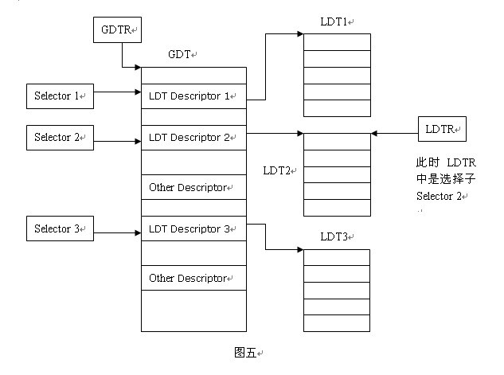

# Basic Concept

## 操作系统特征

- **并发**

- **共享**

    + **互斥共享**

    + **同时访问**

- **虚拟**

- **异步**

- **并发和共享是操作系统最基本的特性**

## 操作系统提供的接口

- **命令接口**

    + **联机命令接口（交互式命令接口）**

    + **脱机命令接口（批处理命令接口）**

- **程序接口**

    + **由一组系统调用（广义指令）组成**

## 操作系统分类

- **批处理系统**

    + **单道批处理系统**

        + **内存中仅有一道程序运行**

    + **多道批处理系统**

        + **允许多个程序同时进入内存**

        + **优点：资源利用率高，系统吞吐量大**

        + **缺点：用户响应的时间较长，不提供人机交互能力**

- **分时操作系统**

    + **时间片**

    + **解决了人机交互问题**

- **实时操作系统**

    + **在严格的时限内处理完接收的事件（无需排队）**

    + **特点：及时性、可靠性**

## 操作系统运行机制

- **时钟管理**

- **中断机制**

    + **中断机制中，只有一小部分功能属于内核**

- **原语**

    + **定义原语的直接方法是关中断**

- **系统控制的数据结构及处理**

## 中断和异常（**内容可能有误**）

- **用户态到核心态的转换是由硬件完成的**

- **中断也称外中断，来自CPU执行指令以外的事件发生，例如I/O等**

- **异常也称内中断或陷入（trap），来自CPU执行指令内部的时间，例如地址越界等。异常不能被屏蔽**

- **中断处理过程**

    + **响应中断**

        + **关中断**

        + **保存断点：程序计数器PC**

        + **引出中断服务程序**

    + **中断处理**

        + **执行中断服务程序**

            + **保存现场和屏蔽字：程序状态字寄存器PSWR、通用寄存器**

            + **开中断（为了实现中断嵌套）**

            + **关中断（保证恢复现场时不被打断）**

            + **恢复现场和屏蔽字**

            + **开中断、中断返回**

- **上述过程中，1~3步是由硬件自动（中断隐指令）完成的**

## 系统调用

- **用户程序可以执行陷入指令（又称访管指令或trap指令）来发起系统调用。访管指令是在用户态使用的，所以不是特权指令**

- **经典系统调用**

    + **fork()：创建进程**

        > 复制父进程的所有变量和内存，复制父进程的所有CPU寄存器（一个寄存器例外）

        + **返回值**

            + **若成功，子进程的fork()返回0；若失败，返回-1**

            + **若成功，父进程的fork()返回子进程标识符PID；若失败，返回-1**

    + **exec()：创建进程映像PCB**

        > exec()为一个函数族，包括execl()、execlp()、execv()、execle()等等

        > exec()装载新进程映像，它会对子进程的地址空间（代码段、堆栈、堆等）进行覆盖重写，这也是为何fork()复制出来的子进程执行之后与父进程不一样的根本原因（fork()之后子进程还在父进程内运行，exec()创建新进程映像PCB，使之脱离父进程执行）

        + **PID没有改变**

        + **允许进程加载一个完全不同的程序，并从main开始执行**

        + **允许进程加载时指定启动参数**

        + **exec调用成功时**

            + **它是相同的进程**

            + **但是运行了不同的程序**

        + **代码段、堆栈和堆等完全重写**

    + **exit()：进程结束**

        > 进程结束执行时调用exit()，完成进程资源回收

        + **关闭所有打开的文件等占用资源、释放内存、释放大部分进程相关的内核数据结构**

        + **检查父进程是否还存活：**

            + **若存活：保留结果的值直到父进程需要它，进入僵尸（zombie/defunct）状态**

            + **反之，释放所有数据结构，进程结束**

        + **清理所有等待的僵尸进程**

    + **wait()：父进程等待子进程结束**

        > 用于父进程**结束时**等待子进程的结束

        > exit()和wait()连起来解释：当父进程运行结束时，调用wait()，查看是否有子进程还未结束，若无，则直接结束即可；若有，则等待子进程结束，此时子进程称为**孤儿进程**。当子进程结束，调用exit()时，唤醒父进程，将exit()返回值作为父进程中wait()的返回值。若父进程调用wait()前，已经有子进程已经调用exit()函数进入僵尸态，则wait立即对exit()返回值处理

        > **可分为：“当父进程先结束调用wait()时”与“当子进程先结束调用exit()时”两个角度来理解**

        + **子进程结束时通过exit()向父进程返回一个值**

        + **父进程通过wait()接受并处理返回值**

        + **有子进程存活时，父进程进入等待状态，等待子进程的返回结果**

        + **当某子进程调用exit()时，唤醒父进程，将exit()返回值作为父进程中wait的返回值**

        + **有僵尸子进程等待时，wait()立即返回其中一个值**

        + **无子进程存活时，wait()立刻返回**

## 系统调用和常规函数调用区别

- **系统调用需要切换堆栈，函数调用无需切换堆栈**

- **系统调用开销更大**

## Copy On Write（COW）

> 简单来说一般的fork()会在创建子进程的同时，给子进程开辟一块地址空间，并把数据完全复制给子进程，然而在fork()之后立即执行的exec()中又会对子进程的地址空间进行覆盖，那么fork()时复制的数据就完全没用了

> COW技术在fork()时不单独给子进程开辟一块地址空间，而是先让子进程共享父进程的地址空间，若之后有对父或子进程的写入操作，则再调用exec()单独对子进程开辟地址空间

# Process Management

## Process & Thread

- **进程=程序段+相关数据段+PCB**

- **PCB是进程存在的唯一标志**

- **进程特点**

    + **动态性**

    + **并发性**

    + **独立性**

    + **制约性**

- **进程控制块（PCB）**

    + **PCB是进程存在的唯一标识**

- **进程状态**

    + **运行态**

    + **就绪态**

    + **阻塞态**

    + **挂起态**

        + **就绪挂起**

        + **等待挂起**

        + **等待挂起可以转到就绪挂起（反之不能）**

    + **就绪无法直接转阻塞，阻塞无法直接转运行**

    + **运行态变阻塞态是主动行为，阻塞态变就绪态是被动行为**

    + **等待、就绪、运行态均可转变到挂起态**

- **线程**

    + **线程是处理机调度最小单位，进程是资源分配最小单位**

    + **同一个进程内的线程共享地址空间，没有自己独立的地址空间，且共享该进程的全局数据**

    + **同一个进程内的线程共享进程的代码、数据打开文件，但每个线程有自己独立的寄存器和堆栈信息**

    + **分类**

        + **用户级线程**

            > **用户线程和内核线程多对一** 

            + **不依赖于操作系统内核**

                + **内核不感知用户线程的存在**

                + **可用于不支持线程的多进程操作系统**

            + **在用户空间实现的线程机制**

                + **每个进程有私有的线程控制块（TCB）列表**

                + **TCB由线程库函数维护**

            + **同一进程内的用户线程切换速度快**

                + **无需用户态/核心态切换**

            + **允许每个进程拥有自己的线程调度算法**

        + **内核级线程**

            > **用户线程和内核线程一对一**

            + **由内核维护PCB和TCB**

            + **线程执行系统调用而被阻塞不影响其他线程**

            + **线程的创建、终止和切换相对较大**

                + **通过系统调用/内核函数，在内核实现**

            + **以线程为单位进行CPU时间分配**

        + **轻量级线程**

            > **用户线程和内核线程多对多**

            + **内核支持的用户线程。一个进程可有一个或多个轻量级进程，每个轻权进程由一个单独的内核线程来支持**

- **Ucore进程控制块结构：struct proc_struct**

## 进程通信

> **IPC（Inter-Process Communication）**

- **信号（Signal）**

    > **中断通知和处理机制**

    + **信号的接收处理方式**

        + **捕获（Catch）**

        + **忽略（Ignore）**

        + **屏蔽（Mask）**

- **管道（Pipe）**

    > **间接通信**

- **消息队列**

    > **消息队列是操作系统维护的以字节序列为基本单位的间接通信机制**

    + **消息队列可用于进程间的同步操作**

- **共享内存**

    > **共享内存是把同一个物理内存区域同时映射到多个进程的内存地址空间的通信机制**

    + **需要信号量等机制协调共享内存的访问冲突**

### **直接通信**

- **进程必须正确的命名对方**

    + **send(P, message)：发送信息到进程P**

    + **receive(Q, message)：从进程Q接受消息**

- **通信链路的属性**

    + **自动建立链路**

    + **一条链路恰好对应一对通信进程**

    + **每对进程之间只有一个链接存在**

    + **链接可以是单向的，但通常是双向的**

### **间接通信**

- **通过操作系统维护的消息队列实现进程间的消息接收和发送**

    + **每个消息队列都有一个唯一的标识**

    + **只有共享了相同消息队列的进程，才能够通信**

- **通信链路的属性**

    + **只有共享了相同消息队列的进程，才能建立连接**

    + **连接可以是单向或双向**

    + **消息队列可以与多个进程相关联**

    + **每对进程可以共享多个消息队列**

### **阻塞通信**

> **同步通信**

- **阻塞发送**

    + **发送者在发送消息后进入等待，直到接收者成功收到**

- **阻塞接收**

    + **接收者在请求接收消息后进入等待，直到成功收到一个消息**

### **非阻塞通信**

> **异步通信**

- **非阻塞发送**

    + **发送者在发送消息后，可立即进行其他操作**

- **非阻塞接收**

    + **没有消息发送时，接收者在请求接收消息后，接收不到任何消息**

### **通信链路缓冲**

- **0容量**

- **有限容量**

- **无限容量**

## 调度

- **分类**

    + **作业调度**

    + **中级调度**

    + **进程调度**

- **调度方式**

    + **非剥夺调度（非抢占）**

    + **剥夺调度（抢占）**

- **调度算法评价准则**

    + **CPU利用率：一段时间内CPU忙时段与整段时间之比**

    + **系统吞吐量：单位时间内CPU完成作业的数量**

    + **周转时间：作业完成时间-作业提交时间**

    + **带权周转时间：作业周转时间 / 作业实际运行时间**

    + **等待时间：进程在就绪队列中的总时间**

    + **响应时间：从提交请求到产生响应所花费的总时间**

- **典型调度算法**

    + **先来先服务**

        > **FCFS**

        + **不可剥夺，算法简单，效率低，对长作业有利，对短作业不利，有利于CPU繁忙型作业，不利于I/O繁忙型作业**

    + **短进程优先**

        + **SPN（Shortest Process Next）**

            > **短进程优先**

        + **SJF（Shortest Job First）**

            > **短作业优先**

            + **平均等待时间、平均周转时间最少**

            + **可能导致饥饿**

        + **SRT（Shortest Remaining Time）**

            > **短剩余时间优先**

        

        

    + **优先级调度**

        + **非剥夺式**

        + **剥夺式**

        + **静态、动态优先级**

        + **系统进程 > 用户进程**

        + **交互型进程 > 非交互型进程**

        + **I/O型进程 > 计算型进程（让I/O设备尽早开始工作）**

    + **高响应比优先**

        > **HRRN（Highest Response Ratio Next）**

        + **响应比 = （等待时间+要求服务时间） / 要求服务时间**

        + **不可抢占**

    + **时间片轮转调度**

        > **RR（Round Robin）**

        + **被剥夺处理机的进程返回到就绪队列的末尾**

    + **多级反馈队列调度**

        > **MFQ（Multilevel Feedback Queues）**

    + **公平共享调度算法**

        > **FSS（Fair Share Scheduling）**

    + **Stride调度**

        > **重点**

        > **每个进程维护一个Stride值与pass值，每次执行进程后Stride += Pass**

        + **Stride越小的进程越先被调度**

        + **pass越小的进程被调度的次数（机会）越多**

        > **在实际实现中，其实是维护Stride和Priority值，PASS = BIG_VALUE / PRIORITY，优先级越大被调度的机会就越多（对应于PASS越小）**

        + **为保证Stride溢出后仍能正确调度，需满足：**

            + **STRIDE_MAX - STRIDE_MIN <= PASS_MAX（天然满足）**

            + **BIG_VALUE需小于无符号整数最大值的一半（即011111....）**

            + **Stride和Pass是无符号整数，但在判断Stride大小时，以有符号整数判断：signed（Proc.A.Stride - Proc.B.Stride），先无符号减再转有符号**

        + **Stride调度算法特征：**

            + **基于优先级（Priority-based）**

            + **调度选择是确定的（Deterministic）**

    + **Lottery调度**

    + **CFS**

    + **实时调度**

        + **速率单调调度算法（RM，Rate Monotonic）**

        + **最早截止时间优先算法（EDF，Earlist Deadline First）**

    + **多处理机调度**

        + **对称多处理机调度（SMP，Symmetric multiprocessing）**

            + **静态分配**

                + **进程被分配到固定的处理机上执行**

                + **各处理机分别维护进程队列**

            + **动态分配**

                + **进程在执行中可分配到任意空闲处理机执行**

                + **各处理机共享进程队列**

- **硬时限 & 软时限**

    + **硬时限：必须验证在最坏情况下能够满足时限**

    + **软时限：尽量保证满足任务时限**

- **优先级反置（Priority Inversion）**

    > **操作系统中出现高优先级进程长时间等待低优先级进程所占用资源的现象**

    + **解决方式**

        + **优先级继承（Priority Inheritance）**

            > **占用资源的低优先级进程继承申请资源的高优先级进程的优先级**

        + **优先级天花板协议（Priority Ceiling Protocol）**

            > **占用资源进程的优先级和所有可能申请该资源的进程的最高优先级相同**

## 进程同步

> 同步与互斥

- **进程间的交互关系**

    + **互斥：一个进程占用资源，，其他进程不能使用**

    + **死锁：多个进程各占用部分资源，形成循环等待**

    + **饥饿：其他进程可能轮流占用资源，一个进程一直得不到资源**

- **禁用中断实现同步**

- **软件实现同步**

    + **皮特森**

    + **Dekkers**

    + **N线程**

        + **Eisenberg和McGuire**

- **硬件实现同步**

    + **Test And Set（TS）**

        + **自旋锁（Spinlock）**

            + **无法实现按序服务**

        + **无忙等待锁**

    + **Exchange**

## 信号量

- **P() & V()**

    + **P可能被阻塞，V不会阻塞**

- **管程（Monitor）**

    + **任何时刻最多只有一个线程执行管理代码**

    + **进程互斥访问**

    + **统一了PV操作，集中由管程实现**

    + **条件变量“没有值”，仅实现排队/等待功能**

        + **Condition.wait()：加入等待队列，释放管程使用权**

        + **Condition.signal()：唤醒等待队列的一个线程**

    + **管程条件变量的释放处理方式**

        + **Hasen**

            > **"while"**

            + **x.signal()之后原进程继续执行**

        + **Hoare**

            > **"if"**

            + **x.signal()之后唤醒进程，并切换到唤醒的进程中进行**

    + **组成**

        + **一个锁**

            + **控制管程代码的互斥访问**

        + **0或者多个条件变量**

            + **管理共享数据的并发访问**

- **经典问题**

    > **学堂在线有管程/PV伪码讲解**

    + **生产者-消费者**

    + **读者-写者**

    + **哲学家**

    + **吸烟者**

    + **理发师**

## 死锁

> **由应用程序处理死锁，操作系统往往忽略死锁**

- **必要条件（任一不成立，死锁一定不发生）**

    + **互斥**

    + **非抢占**

    + **持有并等待**

    + **循环等待**

- **死锁预防**

    + **破坏上述四个条件之一**

- **死锁避免**

    + **银行家算法**

- **死锁检测**

    > **对于进程个数为n，资源类型为m的"死锁检测算法"时间复杂度O(m x n^2)**

    + **资源分配图**

    + **死锁定理**

- **死锁解除**

    + **资源剥夺**

    + **撤销进程**

    + **进程回退**

- **安全状态与死锁的关系**

    + **系统处于安全状态，一定没有死锁**

    + **系统处于不安全状态，可能出现死锁**

        + **死锁时，系统一定处于不安全状态**

# Memory Management

## 装入与链接

- **静态链接**

- **装入时动态链接**

- **运行时动态链接**

- **绝对装入**

    + **装入之后地址确定，运行时不可更改**

- **可重定位装入**

    + **装入之后地址确定，运行时不可更改**

- **动态运行时装入：动态重定位**

    + **例如虚拟内存管理中的逻辑地址就是动态运行时装入**

## 内存保护

- **重定位寄存器（基址寄存器）、界地址寄存器（限长寄存器）**

## 覆盖（Overlay）与交换（Swapping）

- **覆盖**

    > **程序员根据进程模块，将进程内部划分为不同模块，无调用关系的模块之间可以相互覆盖**

- **交换**

    > **将整个进程的地址空间换入或换出内存**

## 连续分配管理

> **缺点：内存利用率低**

- **单一连续分配**

    + **内存中始终只有一道程序**

- **固定分区分配**

    + **有内部碎片、无外部碎片**

- **动态分区分配**

    + **无内部碎片、有外部碎片**

    + **动态分区分配策略**

        + **最先匹配（First-fit）**

            + **优点**

                + **简单**

                + **在高地址空间有大块的空闲分区**

            + **缺点**

                + **外部碎片**

                + **分配大块时较慢**

        + **最佳匹配（Best-fit）**

            + **优点**

                + **相对简单**

                + **避免大空闲分区被拆分**

                + **减小外部碎片的大小**

            + **缺点**

                + **产生最多的外部碎片**

                + **释放分区较慢**

        + **最差匹配（Worst-fit）**

            + **优点**

                + **中等大小的分配较多时，效果最好**

                + **避免出现太多的小碎片**

            + **缺点**

                + **释放分区较慢**

                + **外部碎片**

                + **容易破坏大的空闲分区，因此后续难以分配大分区**

        + **邻近适应**

    + **碎片整理**

        + **紧凑（compaction）**

            + **所有的应用程序必须可以动态重定位**

            + **优先移动处于阻塞状态的进程**

        + **分区对换（swap）**

            + **抢占并回收处于阻塞（等待）状态进程的分区，以增大可用内存空间**

- **伙伴系统（Buddy System）**

    > **每次分配的空间都为2的整数次幂**

    + **会产生内部碎片和外部碎片**

    + **可分配总分区大小需为2的整数次幂，即2^U**

    + **需要的分区大小为2^U / 2 < s <= 2^U，把整个块分配给该进程**

        + **如s <= 2^i / 2，即s的两倍比当前分区还小，那么将该大小为2^i的当前空闲分区划分成两个大小为2^(i - 1)的空闲分区**

        + **重复上述划分过程，直到2^i / 2 < s <= 2^i，即该s比该分区小，且s的两倍比该分区大，并把整个空闲分区分配给该进程**

    + **空闲块合并条件**

        > **以进程分配的二叉树结构图描述：待合并的两个叶子节点必须同属一个父节点**

        + **大小相同，都为2^i**

        + **地址相邻**

        + **起始地址较小的块的起始地址必须是2^(i + 1)的倍数**

## 非连续分配管理

> **内存利用率高**

- **按字节寻址**

    + **相隔一个字节顺序编址一次（例如0字节处为0x0000，1字节处就为0x0001）**

    + **存取数据也是按字节**

- **程序运行时需一次性将所有页面装入内存才能运行**

- **基本分页存储管理**

    + **页大小固定（类比于固定分区分配，会产生少量内部碎片）**

    + **顶级页表最多只能占一个页面的空间**

    + **每个进程一个页表，常驻内存**

    + **页号和页偏移量对用户是透明的**

    + **只需判断页号是否越界（页偏移不可能越界）**

    + **作业地址空间是一维的，即只需一个参数即可确定物理地址**

    + **页可以有特权级**

    + **页表结构**

        + **帧号（物理页号）：f**

        + **页表项标志**

            + **存在位（resident bit）**

            + **修改位（dirty bit）**

            + **引用位（clock/reference bit）**

    + **多级页表**

        > **访问过程：顶级页表起始地址加上逻辑地址中的顶级页号找到顶级页表中的对应页表项，顶级页表页表项存储下一级页表的起始地址（很关键，在多级页表中，除了最后一级页表的页表项中存储物理页号，其余页表的页表项都存储着下一级页表的起始地址），将下一级页表的起始地址加上逻辑地址中的下一级页号即可找到下一级页表中对应的页表项，以此类推**

        + **逻辑地址结构**

            + **每一级页表的逻辑地址均表示对应页表的页号**

        + **顶级页表起始地址保存在CR3寄存器中，地址转换时调入PTBR**

        + **在多级页表中，除了最后一级页表的页表项中存储物理页号，其余页表的页表项都存储着下一级页表的起始地址**

        + **虚拟地址分配连续、物理地址分配不连续**

        + **由于一级页表一般占一个物理块的大小，所以页表的起始地址的形式一般为页框号+若干个0（块内偏移为0）**

        + **TRICKS：**

            + **个人见解：在操作系统中，对于页表这种比较底层的程序或者文件，一般都是按物理块来分配的，也就是说页表等的分配直接开若干块物理块分配，所以页表起始地址的块内偏移也就为0（为什么页表的起始地址偏移为0也有页表的大小恰好为一个物理块大小的原因）。对于进程内部的数据分配，由于数据非常杂，而且单个数据占存储空间比较小，所以就以进程为单位，分配页表，开一块物理空间给数据存储，块内继续分配。**

    + **页寄存器**

        > **每个帧与一个页寄存器关联**

        + **页寄存器**

            + **使用位**

            + **占用页号**

            + **保护位**
        
        + **页表大小与逻辑地址空间大小无关**

        + **对逻辑地址Hash映射，减少搜索范围**

    + **反置页表**

        + **基于Hash映射查找对应页表项中的帧号（进程标识+页号进行Hash映射）**

- **基本分段存储管理**

    + **段大小不固定（类比于动态分区分配，会产生外部碎片）**

    + **段内地址连续，段间不要求连续**

    + **每个进程一个段表，常驻内存**

    + **段号和段偏移量是由用户显示提供**

    + **需判断段号以及段偏移是否越界**

    + **作业地址空间是二维的，既需给出段名，又需给出段内地址，即需两个参数才可确定物理地址（因为段长是不定的）**

    + **段可以有特权级**

    + **优点**

        + **方便编程**

        + **信息保护和共享**

        + **动态增长及动态链接**

- **基本段页存储管理**

    + **每个进程一张段表，每个段对应一张页表**

    + **用分段方法来分配和管理用户空间，用分页方法来管理物理存储空间**

## 虚拟内存管理

> **虚拟存储 = 物理内存 + 磁盘**

- **局部性**

    + **时间局部性**

    + **空间局部性**

    + **分支局部性**

- **虚拟存储器特征**

    + **多次性：无须在作业运行时一次性全部装入内存（与普通的页/段/段页式存储的本质区别），允许被分成多次装入**

    + **对换性**

    + **虚拟性**

- **请求分页管理方式**

    + **页表机制**

    + **缺页中断机构**

    + **地址变换机构**

- **页表项结构**

    + **驻留位**

    + **修改位**

    + **访问位**

    + **保护位**

- **页面锁定（Frame Locking）**

    > **必须常驻物理内存的页面，不能换出**

    > **通过页表中的锁定标志位（lock bit）实现**

    + **操作系统的关键部分**

    + **要求响应速度的代码和数据**

### **局部页面置换算法**

> **置换页面的选择范围仅限于当前进程占用的物理页面内**

- **OPT**

    > **堆栈式算法**

    + **（未来）最长时间内不再被访问的页面（无法实现）**

- **FIFO**

    > **队列式算法（Belady）**

    + **最先进入页表的页面最先被换出**

    + **有可能发生Belady异常：分配物理块数增大而缺页次数不减反增的异常现象**

    + **Belady异常例子：页面访问序列为 1，2，3，4，1，2，5，1，2，3，4，5 时，当分配3个页帧时，发生9次缺页中断，当分配4个页帧时，发生10次缺页中断**

- **LRU（Least Recently Used）**

    > **堆栈式算法**

    + **（过去）最近最长时间未访问过的页面（考察访问间隔时间）**

    + **LRU可退化为FIFO**

        + **例子：分配3个物理页面，页面访问次序为1，2，3，4，5，6，1，2，3**

    + **TRICKS**

        + **沿访问页号往前找，直到找到总页帧数-1个页号，那么剩余的那个页帧就是最近最久未被访问的，应换出**

- **LFU（Least Frequently Used）**

    > **队列式算法（Belady）**

    + **（过去）最近最少使用的页面（考察访问次数）**

    + **有可能发生Belady异常**

    + **Belady异常例子：0，0，1，1，1，2，2，0，0，2，2，3，1，3，1，3，1，3，1，3，1，3，1，3，1，3，1，3，1...（3，1无限循环）。物理页面数是2时，之后的3和1循环段不会出现任何缺页；物理页面数为3时，3和1循环段总是缺页**

- **CLOCK（NRU）**

    > **队列式算法（Belady），学堂在线两道题可做**

    + **循环扫描缓冲区，访问位为1则置0，直到找到第一个访问位为0的页面换出**

    + **有可能发生Belady异常**

- **改进型CLOCK**

    > **队列式算法（Belady）**
    
    + **两个标志位，访问位与修改位**

    + **有可能发生Belady异常**

> **Question：堆栈式算法不可能发生Belady异常，如何证明？**

### **全局页面置换算法**

> **置换页面的选择范围是所有可换出的物理页面**

> **全局置换算法为进程分配可变数目的物理页面**

- **工作集置换算法**

    + **工作集：当前访问页面加上过去Δt个访问的页面（Δt包括当前页面）**

    + **算法：每次访问页面时，将不在工作集内的页面调出（无论物理页面是否够用，只要不在工作集就调出）**

- **缺页率置换算法（PFF，Page-Fault-Frequency）**

    + **若t_current - t_last > T，则置换所有在[t_last，t_current]时间内没有被引用的页**

    + **若t_current - t_last <= T，则增加缺失页到常驻集中**

## 负载控制

> **通过调节并发进程数（MPL）来进行系统负载控制**

- **ΣWSi = 内存的大小**

- **平均缺页间隔时间（MTBF） = 缺页异常处理时间（PFST）**

## 页面分配策略

- **固定分配：每个进程分配一定数目的物理块，后不再改变**

- **可变分配：先分配一定数目物理块，后可动态改变**

- **局部置换：只能从进程自身已分配的物理块中换出页面，换入页面**

    + **OPT、FIFO.......**

- **全局置换：可以抢夺其他进程的空闲物理块给自己用**

    + **工作集置换算法、缺页率置换算法**

- **上述四种子策略衍生下述三种组合**

    + **固定分配局部置换**

    + **可变分配全局置换**

    + **可变分配局部置换**

## 其他

- **驻留集：给一个进程分配的物理页框的集合就是这个进程的驻留集**

- **工作集：在某段时间间隔内，进程要访问的页面集合（注意是集合，元素互异）**

- **抖动：频繁的页面调度（换入换出）行为**

- **TRICKS**

    + **一般来说分配给进程的物理块数（即驻留集大小）要大于工作集大小**

    + **虚拟存储器最大容量由计算机地址结构决定**

    + **分清楚页（段）式存储与虚拟页（段）式存储的区别**

        + **页（段）式存储**

            > **也叫基本页（段）式存储**

            + **程序所有页面一次性全部调入内存**

        + **虚拟页（段）式存储**

            > **也叫请求页（段）式存储**

            + **只需将程序一小部分页面调入内存即可开始运行**

            + **在基本页（段）式存储管理的基础上，增加请求调页和页面置换思路**

## PAE（Physical Address Extension）

> **物理地址扩展**

# File Management

- **同个进程读写文件共用一个指针，多个进程读写同一个文件各用一个指针**

- **文件首次打开过程**

    + **open系统调用将该文件的文件控制块（FCB）复制到内存中，加入操作系统维护的一个打开文件表中，并将FCB在表中的索引位置返回给用户**

    + **在用户需要文件操作的时候，利用索引指针访问文件的索引节点，进而读取物理块数据**

    + **打开文件无需将文件的内容复制到内存中**

- **文件逻辑结构**

    + **无结构文件（流式文件）**

    + **有结构文件（记录式文件）**

        + **顺序文件（效率最高）**

        + **索引文件**

        + **索引顺序文件**

        + **直接文件或散列文件**

- **文件控制块（FCB）和索引节点（inode）**

- **目录结构**

    + **单机目录结构**

        + **不允许重名**

    + **两级目录结构**

    + **多级目录结构（树形目录结构）**

    + **无环图目录结构**

- **文件共享**

    > **单个文件默认计数为1，当计数为0时，当前文件就不存在了**

    + **硬链接（基于索引结点的共享方式）**

        > **硬链接本质是上增加“引用”，多了个名字而已，其余属性与原文件均相同。例如文件A初始计数为1，B硬链接到A，此时A，B计数都为2，然后D硬链接到B，此时A，B，D计数都为3。（把硬链接的文件当作一个整体来看，不区分前后继承链接关系）**

        + **直接在两个用户的文件目录中用同一个指针指向被共享文件的物理块地址**

        + **文件拥有者（首次创建者）将文件删除后，另一个用户会因指针失效而访问文件失败**

    + **软链接（利用符号链实现文件共享）**

        > **软链接不增加计数。例如文件A初始计数为1，创建A的软链接C，此时A的计数还是1，但C的计数与A相同也为1**

        + **记录被共享文件的完整访问路径，每次需要访问共享文件时，沿着访问路径进行查找**

        + **文件拥有者将文件删除后，同样会找不到该文件，但若在删除后访问前，又在同目录下创建了同名文件，则访问依然成功，但此时显然文件已不是原来的文件了**

- **文件保护**

## 文件系统层次结构

- **用户调用接口**

- **文件目录系统**

- **存取控制验证模块**

- **逻辑文件系统与文件信息缓冲区**

- **物理文件系统**

- **辅助分配模块**

- **设备管理程序模块**

## 目录实现

- **线性列表**

- **哈希表**

## 文件实现

- **文件分配方式**

    + **连续分配**

        + **会产生外部碎片**

    + **链接分配**

        + **隐式链接**

            + **每个盘块都有指向下一个盘块的后继指针**

        + **显式链接**

            + **使用文件分配表（FAT）来存储所有各物理块的链接关系以及空闲块，整个磁盘中仅设置一张FAT**

        + **索引分配**

            + **TRICKS**

                + **多级间接地址块的分配的基本单位是簇，而不是索引结点的大小**

## 文件存储空间管理

- **空闲表法**

- **空闲链表法**

- **位示图法**

- **成组链接法**

## 磁盘（HDD）

- **一次读写操作涉及的操作时间**

    + **寻道时间**

    + **（旋转）延迟时间**

    + **（数据）传输时间**

- **磁盘调度算法**

    + **FCFS**

    + **SSTF**

    + **SCAN**

    + **C-SCAN**

    + **LOOK**

    + **C-LOOK**

    + **N-step-SCAN**

    + **FSCAN**

- **磁盘缓存**

    + **单缓存 & 双缓存**

    + **磁盘缓存置换算法**

        + **访问频率置换算法（Frequency-based Replacement）**

            + **短周期LRU**

            + **长周期LFU**

- **磁盘地址用“柱面号·盘面号·扇区号”表示**

## SSD

- **FLASH芯片目前有四类**

    + **SLC（Single-Level Cell）：综合性能最强，P/E次数最多，延迟最小，R/W、4K Random R/W最快**

        + **Cell电位只有一位，总共两种状态0，1**

    + **MLC（Multi-Level Cell）**

        + **Cell电位只有两位，总共四种状态00，01，10，11**

    + **TLC（Triple-Level Cell）**

        + **Cell电位只有三位，总共八种状态000，001，010，011，100，101，110，111**

    + **QLC（Quad-Level Cell）**

        + **Cell电位只有四位，总共16种状态**

- **FLASH芯片每个单元（Cell）电位越多，意味着能存放的数据越多，结构相对更复杂，出错的概率更大**

## 其他

- **FAT32 & exFAT & NTFS**

    + **FAT32和exFAT适用于小容量移动式存储设备的存取，如U盘等。FAT32最高支持单文件4GB，而exFAT无此限制**

    + **NTFS适用于大容量，访问频繁的存储设备的存取**

- **自举程序通常保存在ROM中**

- **BIOS 与 UEFI**

- **引导分区**

- **CMOS**

- **低级格式化（物理格式化）**

    + **对磁盘重新进行物理分区**

- **逻辑格式化**
    
    + **一般意义上的格式化操作是指逻辑格式化。即创建文件系统，初始化空闲以及已分配空间的数据结构**

- **簇**

    + **操作系统为改善磁盘访问时间，一般以簇（若干物理扇区组成）为单位进行空间分配**

# I/O Management

## I/O设备

- **块设备**

    + **传输速率较高，可寻址**

    + **磁盘、硬盘、软盘、光盘、u盘等**

- **字符设备**

    + **以字节为单位顺序访问**

    + **传输速率较低，不可寻址**

    + **交互式终端机、打印机、键盘、鼠标、并口、串口等**

- **网络设备**

    + **以太网卡、wifi网卡、蓝牙设备（网盘设备是块设备不是网络设备）**

## I/O控制方式

- **程序直接控制（PIO）**

    > **适合字符设备**

- **中断驱动**

    + **I/O设备每读取一个单位都要引发一次中断通知CPU**

- **DMA（Direct Memory Access）**

    > **适合块设备**

    + **只需要在开始传输数据与结束传输数据时引发中断通知CPU**

    + **DMA控制器中设置4类寄存器**

        + **命令/状态寄存器（CR）**

        + **内存地址寄存器（MAR）**

        + **数据寄存器（DR）**

        + **数据计数器（DC）**

- **通道控制**

## I/O子系统的层次结构

- **用户层I/O软件**

- **设备独立性软件**

- **设备驱动程序**

- **中断处理程序**

- **硬件设备**

    + **设备控制器**

        + **设备控制器与CPU接口**

        + **设备控制器与设备的接口**

        + **I/O控制逻辑**

## Cache & Buffer

- **磁盘高速缓存**

- **缓冲区**

    + **单缓冲**

        + **处理时间：max(C, T) + M**

    + **双缓冲**

        + **处理时间：max(C + M, T)**

    + **循环缓冲**

    + **缓冲池**

## 设备分配数据结构

- **设备控制表（DCT）**

- **控制器控制表（COCT）**

- **通道控制表（CHCT）**

- **系统设备表（SDT）**

## 设备分配策略

- **静态分配**

- **动态分配**

## SPOOLING（假脱机）

# MBR & GPT

# BIOS & UEFI

# Ucore

## Ucore库函数

> Ucore库函数

- **read()：读文件**

    + **参数**

        + **int fd：文件句柄**

        + **void \*buf：数据缓冲区指针**

        + **int length：数据缓冲区长度**

    + **返回值**

        + **int return_value：返回读出数据的长度**

- ****

## 实验部分

### **基本概念**

- **控制寄存器**

    + **CR0：第0位是保护允许位PE（Protected Enable），第31位是页机制使能位（PG）**

        > **若PG要置1（即开启页机制），则PE必须已经（或者同时）置1，即页机制必须在保护模式以及段机制已经使能的状态下启动**

        + **PE若置0，则在实模式下运行**

        + **PE若置1，则在保护模式下运行**

        + **PG若置0，则不开启页机制**

        + **PG若置1，则开启页机制**

    + **CR1：未定义**

    + **CR2（页故障线性地址寄存器）：保存最后一次出现页故障的32位线性地址**

    + **CR3（页目录基址寄存器）：保存页目录表的物理地址**

        > **也叫做PDBR（Page-Directory Base address Register）**
        
        > **注意和PTBR（Page Table Base address Register）区分。在实际运行中，CR3中的值会调入PTBR执行**

- **段寄存器**

    + **CS（Code Segment）：存放当前执行的程序的段地址**

    + **DS（Data Segment）：存放当前执行的程序的数据的段地址**

    + **SS（Stack Segment）：存放当前执行的程序所用堆栈的段地址**

    + **ES（Extra Segment）：存放当前执行的程序中一个辅助数据段的段地址**

    + **FS**

    + **GS**

- **GDT（Global Descriptor Table）**

    > **全局描述符表，本质上是段表**

    + **GDT全局只有一张表，表项为段描述符（Segment Descriptor）**

- **LDT(Local Descriptor Table)**

    > **局部描述符表，本质上是段表**

    + **每个程序最多有一张，全局可多张LDT**

- **Segment Selector**

    > **段选择子，即段号（GDT的表项索引）**

    + **段选择子其实就是段号，存于段寄存器中的高位**

    

- **IDT（Interrupt Descriptor Table）**

    > **中断描述符表（在实模式下叫做“中断向量表”）**

    + **IDT全局只有一张表，表项为门描述符（Gate Descriptor）**

    + **门描述符（Gate Descriptor）类别**

        + **中断门（Interrupt Gate）**

            + **中断门中的DPL=0**

        + **陷阱门（Trap Gate）**

            + **陷阱门中的DPL=0**

        + **系统门（System Gate）**

            > **系统门其实就是汇编中的INT指令，通过INT指令引发系统调用。由于用户态不能直接执行内核态的系统调用，也不能直接访问中断门、陷阱门，所以设置了系统门来为用户态的进程访问陷阱门**

            + **系统门中的DPL=3**

### **Lab1：bootloader启动ucore**

- **OS启动流程简述**

    + **CPU加电启动（此时处于i8086 16位实模式，寻址空间只有1M），CS、EIP寄存器初始化为BIOS的EPROM所在地，进而跳转到BIOS中进行**

    + **BIOS加载存储设备上的第一个扇区（主引导扇区，Master Boot Record，MBR）的512字节到内存的0x7c00，然后跳转到该地址的第一条指令开始执行后续OS启动步骤，即bootloader**

    + **bootloader做的事：**

        + **使能保护模式 & 段机制**

            + **使能保护模式要设置CR0的bit => 0**

            + **段机制在保护模式下是自动使能的**

        + **从硬盘上读取kernel in ELF格式的ucore kernel（跟在MBR后面的扇区）并放到内存中固定位置**

        + **跳转到ucore OS的入口点执行，这时控制权到了ucore OS中**

- **C函数调用**

    > PPT主要结合栈以及栈帧的变化分析

    + **参数和函数返回值可通过寄存器或位于内存中的栈来传递**

    + **不需要保护/恢复所有寄存器**

- **GCC内联汇编**

- **X86的中断处理**

    + **每个中断或异常与一个中断服务例程（ISR）关联，其关联关系存储在中断描述符表（IDT）**

        + **IDT的起始地址和大小保存在中断描述符表寄存器IDTR中**

### **Lab2：物理内存管理**

- **X86保护模式特权级**

    + **特权级**

        > **Linux和Ucore只使用Level 0和Level 3**

        + **Level 0：操作系统内核**

        + **Level 1 & Level 2：操作系统服务（如设备驱动）**

        + **Level 3：应用程序**

    + **特权级判断**

        + **概念**

            > **SS(Segment Selector)段选择子**

            + **RPL（Requested Privilege Level）：存于段寄存器DS，ES，FS，GS的低2位**

            + **CPL（Current Privilege Level）：存于段寄存器CS，SS的低2位**

            + **DPL（Descriptor Privilege Level）：段描述符，门描述符**

        + **判断**

            + **访问门时（中断门、陷入门、异常门）**

                + **CPL <= DPL[门] & CPL >= DPL[段]**

            + **访问段时**

                + **MAX（CPL，RPL） <= DPL[段]**

        + **特权级切换**

            + **ring0 => ring3**

                > **内核态 => 用户态**

                + **内核态的栈中压入的CS中的CPL改为3（模拟产生中断进行内核态到用户态跳转，此时内核态的栈会多压入SS（RPL=3）与ESP），通过IRET指令将内核态栈的信息弹出栈，恢复到对应的寄存器里，同时用户态的栈也已经形成。此时其实已经完成特权级转换，因为访问寄存器里的CPL、RPL已经等于3了，处在ring3**

            + **ring3 => ring0**

                > **用户态 => 内核态**

                + **用户态产生软中断或者外中断等引发中断服务例程，保存相关用户态栈信息到内核态栈，在执行IRET指令中断返回时，修改内核态的栈，将CS的CPL设为0（不再需要SS和ESP），此时IRET返回后，CPU恢复现场信息，此时相应寄存器中的CPL=0，处于ring0**

        + **TSS（Task Statement Segment）**

            + **保存ring0的SS和ESP**

- **X86内存管理单元（MMU）**

    + **线性地址（Linear Address） & 物理地址（Physical Address） & 虚拟地址（Virtual Address）**

        + **页机制启动后，线性地址=虚拟地址**

        + **页机制启动前，线性地址=物理地址**

        + **在页表项中存放的地址内容是线性地址（Linear Address）**

    + **在保护模式下使能页机制，OS需要设置CR0寄存器中的最高位为1（PG）**

        > **若PG要置1（即开启页机制），则PE必须已经（或者同时）置1，即页机制必须在保护模式以及段机制已经使能的状态下启动**

### **Lab3：虚拟内存管理**

- **关键数据结构**

    + **vma_struct：用于描述“合法”的虚拟页**

- **页访问异常**

    + **Page-Fault Error Code**

        + **P**

            + **0：缺页异常**

            + **1：页保护机制违法**

        + **W/R：页是只读的还是可读可写的**

            + **0：产生错误的访问是一次读操作**

            + **1：产生错误的访问是一次写操作**

        + **U/S：区分页是特权级的还是一般用户的**

            + **0：特权模式访问引发的错误**

            + **1：用户态访问引发的错误**

        + **RSVD**

        + **ID**

- **页换入换出机制**

    + **建立虚拟页和硬盘扇区的对应关系**

        > **本质就是根据存在位（P）来使高位表现出不同的语义。当P=1时，高位表示页号；当P=0时，高位表示磁盘扇区号**

        > **扇区索引信息放在页表项中**

        + **页表项P位表示当前虚拟页是否存在于物理内存中**

            + **若P=0，表示该页不存在物理内存，那么此时页号就表示磁盘扇区号（swap_entry_t）**

            + **若P=1，表示该页存在物理内存，那么此时高位就表示页号**

    + **何时换入/换出页**

        + **重要数据结构**

            + **struct Page**

                + **list_entry_t page_link：空闲物理页链表**

        + **换入**

            + **缺页时换入**

        + **换出**

            + **主动策略**

            + **被动策略（Ucore）**

### **Lab4：内核线程管理**

- **关键数据结构**

    + ****

- **执行流程**

    + **创建第0个内核线程：idleproc()**

        + **idleproc->pid = 0**

        + **idleproc->state = PROC_RUNNABLE**

        + **idleproc->kstack = bootstack**

        + **idleproc->need_resched = 1**

    + **创建第1个内核线程：initproc()**

        + ****

    + **switch_to(from, to)**

        + **from是idleproc的context，to是initproc的context**

### **Lab5：用户线程管理**

- **执行ELF格式的二进制代码**

    + **do_execve()**

        + **清空旧内存空间**

            + **lcr3(boot_cr3)：将cr3页表基址指向内核中的boot_cr3内核页表**

            + **exit_mmap(mm)、put_pgdir(mm)、mm_destroy(mm)：清空内存**

        + **调用load_icode()**

            + **创建新内存空间**

                + **mm_create()、setup_pgdir(mm)**

            + **对ELF中的每一个部分：**

                + **设置VMA**

                    + **代码段：vm_flags设置可执行属性**

                    + **数据段：vm_flags设置可读可写属性**

                    + **mm_map()：完成对合法空间的建立（还未建立页表）**

                + **从ELF中拷贝内容**

                    + **pgdir_alloc_page()：建立虚拟地址到物理地址映射**

                    + **memcpy()：拷贝内容**

                + **prepare all zero memory（bss段清空）**

            + **设置用户堆栈**

                + **mm_map()：建立用户堆栈**

                + **pgdir_alloc_page()：建立页表映射关系**

            + **加载新页表**

            + **设置trapframe**

- **进程复制**

- **Copy On Write**

### **Lab6：调度器**

- **Round Robin**

- **Stride**

### **Lab7：同步互斥**

- **底层支撑**

    + **处理机调度**

    + **等待队列**

    + **屏蔽中断**

        + **EFLAGS中的Interrupt Enable Flag设为1则允许中断；设为0则屏蔽中断**

            + **CLI指令：屏蔽中断**

            + **STI指令：使能中断**

- **管程和信号量设计实现**

    > **PPT代码真题考过**

### **Lab8：文件系统**

- **Simple File System**

    + **SFS的超级块保存在硬盘上，在加载SFS时会读入内存中**

    + **SFS的free map结构保存在硬盘上，表示硬盘可用的数据块（扇区）**

    + **SFS的root-dir inode结构保存在硬盘上，表示SFS的根目录的元数据信息**

    + **硬盘上的SFS，除了上述三种结构外，剩下的用于保存文件的inode，dir/file的data**

- **Virtual File System**

- **I/O接口设备分析**

- ****

